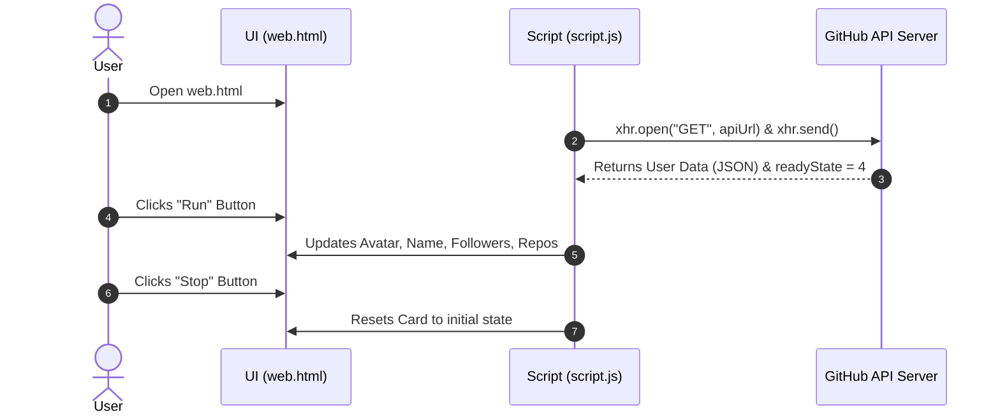

# GitHub Profile Card - Web API Project Documentation

## 1. Project Overview
Yeh project ek **Dynamic GitHub Profile Card** hai jo browser ki built-in **Web API (`XMLHttpRequest`)** ko use karke GitHub ke public server se real-time user data fetch karta hai aur us data ko DOM (Document Object Model) ke zariye UI par dynamically display karta hai.

---

## 2. Project File Structure

```text
webAPI/
│
├── web.html      # Structure & markup (HTML layout of the card)
├── style.css     # Styling & visual appearance (Dark Theme)
├── script.js     # Logic & API handling (XMLHttpRequest & Event Listeners)
└── docs.md       # Project documentation
```

---

## 3. Technologies Used
- **HTML5**: Semantic tags aur card structure ke liye.
- **CSS3**: Dark mode UI, Flexbox centering, rounded circular avatar, aur responsive buttons ke liye.
- **JavaScript (ES6+)**: `XMLHttpRequest`, DOM selection, JSON parsing, aur event handling ke liye.
- **GitHub REST API**: `https://api.github.com/users/{username}` endpoint se user profile data lene ke liye.

---

## 4. How the Application Works (Data Flow)



---

## 5. Detailed Code Explanation

### 1. `web.html` (Markup Structure)
`web.html` mein ek central card container define kiya gaya hai:

| Element ID / Class | Type | Purpose |
| :--- | :--- | :--- |
| `.card` | `<div>` | Poore profile card ka main box wrapper |
| `img` | `` | User ki GitHub avatar profile picture display karta hai |
| `#name` | `<h2>` | User ka display name show karta hai |
| `#followers` | `<span>` | Total followers count display karta hai |
| `#public_repos` | `<span>` | Public repositories count display karta hai |
| `#run` | `<button>` | Data show karne wala trigger button |
| `#stop` | `<button>` | Data reset karne wala trigger button |

---

### 2. `style.css` (Design & Layout)
- **Flexbox Centering**: `body` par `display: flex`, `justify-content: center`, `align-items: center` use kiya gaya hai taake card screen ke theek darmiyan (center) mein rahe.
- **Dark Palette**:
  - Background: `#212121`
  - Card Background: `#2c2c2c` (border `#444` ke sath)
  - Text: `#ffffff` aur muted text `#b0b0b0`
  - Accent Color: `#007acc` (Blue)
- **Avatar Styling**: Circular avatar with `border-radius: 50%` aur `object-fit: cover`.
- **Button Styling**:
  - `#run`: Blue theme (`#007acc`) with hover state.
  - `#stop`: Red/Rose theme (`#d9534f`) with hover state.

---

### 3. `script.js` (API Integration & Logic)

#### Step 1: DOM Elements Selection
```javascript
const apiUrl = "https://api.github.com/users/syedrasimali";
const xhr = new XMLHttpRequest();
let avatar = document.querySelector("img");
let run = document.querySelector("#run");
let stop = document.querySelector("#stop");
const names = document.querySelector("#name");
const followers = document.querySelector("#followers");
const repos = document.querySelector("#public_repos");
```

#### Step 2: Sending the HTTP Request
```javascript
xhr.open("GET", apiUrl);
xhr.send();
```
- `xhr.open("GET", apiUrl)`: Request initialize karta hai (Method: GET, URL: GitHub API).
- `xhr.send()`: Request ko network par bhejta hai.

#### Step 3: Handling State Change (`onreadystatechange`)
```javascript
xhr.onreadystatechange = () => {
    if (xhr.readyState === 4) {
        // Ready State 4 ka matlab response successfully aa chuka hai
        run.addEventListener("click", () => {
            const data = JSON.parse(xhr.responseText);
            avatar.src = data.avatar_url;
            names.innerHTML = data.name;
            followers.innerHTML = data.followers;
            repos.innerHTML = data.public_repos;
        });

        stop.addEventListener("click", () => {
            avatar.src = "https://via.placeholder.com/110";
            names.innerHTML = "${username}";
            followers.innerHTML = "0";
            repos.innerHTML = "0";
        });
    }
};
```

---

## 6. Core Concept: Understanding `XMLHttpRequest` (XHR)

### `xhr.readyState` Values
Jab bhi XHR request chalti hai, yeh **5 stages** se guzarti hai:

| State | Constant | Description (Urdu/English) |
| :---: | :--- | :--- |
| **0** | `UNSENT` | `open()` method abhi call nahi hua. |
| **1** | `OPENED` | `open()` call ho chuka hai, request tayar hai. |
| **2** | `HEADERS_RECEIVED` | `send()` call ho chuka hai aur headers receive ho gaye hain. |
| **3** | `LOADING` | Response body download ho rahi hai (data aa raha hai). |
| **4** | `DONE` | Request complete ho chuki hai aur poora data mil chuka hai. |

> [!NOTE]
> `xhr.readyState === 4` par check lagana is liye zaroori hota hai taake hum tabhi data read karein jab server se poori response aa chuki ho.

---

## 7. GitHub API Response Example
GitHub API se aane wala sample response kuch is tarah hota hai:

```json
{
  "login": "syedrasimali",
  "avatar_url": "https://avatars.githubusercontent.com/u/194791641?v=4",
  "name": "Syed Rasim Ali",
  "public_repos": 24,
  "followers": 1
}
```
JavaScript mein `JSON.parse(xhr.responseText)` karke is JSON string ko object mein convert kiya jata hai taake hum `data.name`, `data.avatar_url`, waghera access kar sakein.

---

## 8. How to Run & Test

1. Apne computer par project folder open karein: `c:\Users\Electroghar.pk\Desktop\Practice\webAPI`.
2. `web.html` file par right-click karke **Open with Chrome** (ya kisi bhi browser) mein open karein.
3. **Run** button par click karein:
   - Avatar image GitHub profile se load hogi.
   - Name, Followers, aur Repos update ho jayenge.
4. **Stop** button par click karein:
   - Card wapas reset ho kar initial state par aa jayega.

---

## 9. Possible Future Improvements
- [ ] **Dynamic Username Search**: Ek input box add karein jisme user koi bhi GitHub username type kare aur usi user ka card load ho.
- [ ] **Modern `fetch()` API**: `XMLHttpRequest` ki jagah modern `fetch()` ya `async/await` syntax implement karein.
- [ ] **Error Handling**: Agar user exist na kare (404 Not Found), toh ek friendly error message show karein.
